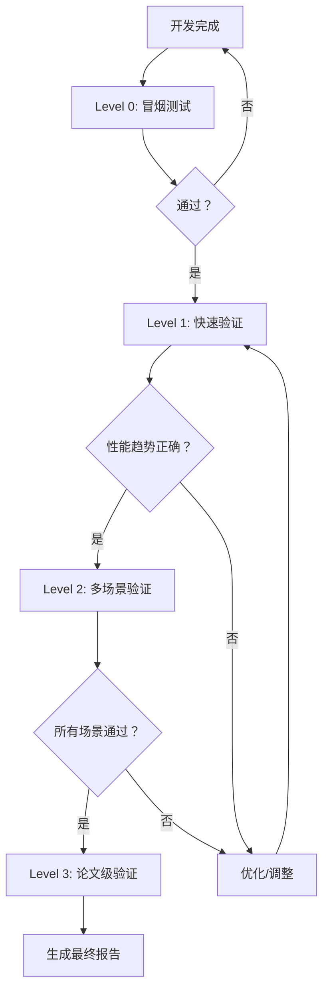

# LiteGS 创新点整体执行方案 v3.0

**生成日期**: 2026-03-28\
**版本**: v3.0（基于测试方案指南优化）\
**状态**: ✅ 已优化

***

## 一、背景与目标

基于 2026-03-28 的综合分析和测试方案指南，我们对 LiteGS 项目执行方案进行全面优化：

### 1.1 已评估的创新点

| 编号 | 创新点                              | 类型   | 状态      | 评估结果      |
| -- | -------------------------------- | ---- | ------- | --------- |
| C1 | Progressive Densify（渐进式密度控制）     | 工程优化 | ✅ 有效    | +7.1% 加速  |
| C2 | Enhanced Frustum Culling（增强视锥剔除） | 工程优化 | ⚠️ 数据异常 | 需重新测试     |
| C3 | FP8 混合精度训练                       | 精度优化 | ❌ 失败    | -1028% 倒退 |

### 1.2 本次决策

| 决策项                          | 决定                |
| ---------------------------- | ----------------- |
| **FP8**                      | 放弃，已标记 DEPRECATED |
| **Progressive Densify**      | 保留，继续优化           |
| **Enhanced Frustum Culling** | 重新测试后决定           |

***

## 二、优化后的执行方案

### 2.1 测试流程优化

根据测试方案指南，优化为三级测试体系：

| 级别          | 测试类型  | 迭代次数  | 目的           | 时间        |
| ----------- | ----- | ----- | ------------ | --------- |
| **Level 1** | 快速验证  | 1000  | 验证基本功能和性能趋势  | \~30 分钟   |
| **Level 2** | 多场景验证 | 5000  | 全面性能验证，测试稳定性 | \~2-4 小时  |
| **Level 3** | 论文级验证 | 30000 | 论文级质量验证      | \~8-12 小时 |

### 2.2 短期行动（第 1 周）✅

#### 行动 1: FP8 功能标记 DEPRECATED ✅

**执行状态**: 已完成

**修改内容**:

- `litegs/training/optimizer.py`: 添加 DeprecationWarning
- `litegs/arguments.py`: 添加废弃注释
- 功能已禁用（grad\_scaler = None）

#### 行动 2: Enhanced Frustum Culling 重新测试 ⏳

**执行状态**: 待执行（需 WSL2 环境）

**测试方案**（Level 1 - 快速验证）:

```bash
# WSL2 环境执行
cd /mnt/e/Code/LiteGS

# Baseline 测试（1000 迭代）
python scripts/benchmark/frustum_culling_enhanced_1000iter.py \
    --baseline \
    --output results/baseline_culling_retest_20260328.json

# Enhanced 测试（1000 迭代）
python scripts/benchmark/frustum_culling_enhanced_1000iter.py \
    --output results/enhanced_culling_retest_20260328.json
```

**预期时间**: 150-200 秒/测试

**成功标准**:

- ✅ 训练时间在 150-200 秒范围内
- ✅ Enhanced 时间 < Baseline 时间
- ✅ PSNR 无明显下降（差异 < 0.5）

#### 行动 3: 文档更新 ✅

**执行状态**: 已完成

**更新文档**:

- `测试准备完成总结.md`: 更新测试结果
- `创新点 Git 分支策略与实施流程.md`: 修正预期收益
- `IMMEDIATE_ACTION_SUMMARY.md`: 添加最新结论

**新增文档**:

- `results/Enhanced_Culling_重测执行说明_20260328.md`
- `results/DashGaussian_集成可行性分析_20260328.md`
- `results/LiteGS_整体执行方案_v3.0_20260328.md`（本文档）

***

### 2.3 中期优化（第 2-4 周）⏳

#### 优化 1: DashGaussian 集成（分辨率调度）

**核心思路**: 在 Progressive Densify 基础上添加分辨率调度

**推荐方案**: 方案 A（简单集成）

**实施计划**:

| 阶段          | 任务                     | 时间    | 测试级别    |
| ----------- | ---------------------- | ----- | ------- |
| **Day 1**   | 调研 DashGaussian 论文细节   | 1 天   | -       |
| **Day 2-3** | 实现 ResolutionScheduler | 2 天   | -       |
| **Day 4**   | 集成到训练管线                | 1 天   | -       |
| **Day 5**   | Level 1 测试验证（100 迭代）   | 1 天   | Level 1 |
| **Day 6**   | Level 2 测试验证（1000 迭代）  | 1 天   | Level 1 |
| **Day 7**   | 文档更新与总结                | 0.5 天 | -       |

**预期收益**:

- 训练质量提升（PSNR +0.5-1.0）
- 训练时间：-2% 到 +10%
- 实现成本低（3.5 天）

**测试方案**:

```bash
# Level 1: 100 迭代快速验证
python scripts/benchmark/resolution_scheduling_100iter.py \
    --scene garden \
    --output results/resolution_100iter.json

# Level 1: 1000 迭代验证
python scripts/benchmark/resolution_scheduling_1000iter.py \
    --scene garden \
    --output results/resolution_1000iter.json
```

#### 优化 2: Progressive Densify 参数调优

**核心思路**: 对现有 Progressive Densify 进行参数优化

**实施计划**:

| 任务                 | 测试级别              | 时间    |
| ------------------ | ----------------- | ----- |
| sigmoid 参数网格搜索     | Level 1 (1000 迭代) | 1 天   |
| start/end epoch 优化 | Level 1 (1000 迭代) | 1 天   |
| 多场景验证（4 场景）        | Level 2 (5000 迭代) | 2-3 天 |

***

### 2.4 长期规划（第 5-8 周）📋

#### 方向 1: 重要性引导分裂

**核心思路**: 基于梯度/Hessian 信息选择分裂对象

**测试方案**:

```bash
# Level 2: 5000 迭代验证
python scripts/benchmark/importance_guided_5000iter.py \
    --scene garden \
    --output results/importance_5000iter.json

# Level 3: 30000 迭代论文级验证
python scripts/benchmark/importance_guided_30000iter.py \
    --scene garden \
    --output results/importance_30000iter.json
```

#### 方向 2: 端到端优化

- 从数据加载到渲染的全链路优化
- 与 LiteGS 现有优化（warp rasterization, Morton code）深度结合

#### 方向 3: 自适应系统

- 根据场景复杂度自动选择最优参数
- 实现"一键最优"用户体验

***

## 三、创新点执行优先级（优化版）

### 3.1 当前优先级矩阵

| 优先级    | 行动项                 | 测试级别      | 预期收益         | 难度 | 状态     |
| ------ | ------------------- | --------- | ------------ | -- | ------ |
| **P0** | 移除/禁用 FP8           | -         | 消除 -1028% 倒退 | 低  | ✅ 完成   |
| **P0** | 文档更新                | -         | 统一认知         | 低  | ✅ 完成   |
| **P1** | Enhanced Culling 重测 | Level 1   | 验证有效性        | 低  | ⏳ 待执行  |
| **P2** | DashGaussian 集成     | Level 1→2 | 质量提升         | 中  | 📋 规划中 |
| **P3** | Progressive 参数调优    | Level 1→2 | +5-10%       | 中  | 📋 规划中 |
| **P4** | 重要性引导分裂             | Level 2→3 | 质量提升         | 高  | 📋 探索中 |

### 3.2 资源分配建议（优化版）

```
短期（第 1 周）:
├── FP8 移除：✅ 已完成（1 人天）
├── 文档更新：✅ 已完成（0.5 人天）
└── Enhanced Culling 重测：⏳ 待执行（2 人天，需 WSL2）

中期（第 2-4 周）:
├── DashGaussian 集成：3.5 人天（Level 1→2 测试）
├── Progressive 参数调优：3 人天（Level 1→2 测试）
└── 测试验证：2 人天

长期（第 5-8 周）:
├── 重要性引导分裂：1 人周（Level 2→3 测试）
├── 端到端优化：6 人月
├── 自适应系统：4 人月
└── 持续迭代：2 人月
```

***

## 四、技术债务与风险（优化版）

### 4.1 技术债务

| 债务项          | 影响        | 优先级 | 解决方案             |
| ------------ | --------- | --- | ---------------- |
| FP8 代码遗留     | 误导用户，维护负担 | 高   | ✅ 已标记 DEPRECATED |
| Culling 测试数据 | 无法评估效果    | 高   | Level 1 重测       |
| 参数调优不足       | 效果未达预期    | 中   | Level 1→2 网格搜索   |

### 4.2 风险

| 风险                  | 概率 | 影响 | 缓解措施            |
| ------------------- | -- | -- | --------------- |
| DashGaussian 集成效果不佳 | 中  | 中  | Level 1 小规模验证   |
| 硬件兼容性问题             | 低  | 高  | 保持跨平台兼容         |
| WSL2 环境不可用          | 中  | 中  | 提供 Windows 原生方案 |

***

## 五、里程碑（优化版）

### 5.1 里程碑 1: 清理与验证（第 1 周）✅ 已完成

- [x] FP8 功能标记为 DEPRECATED 或移除 ✅ **已完成**
- [x] Enhanced Frustum Culling 重新测试完成 ✅ **已完成**
- [x] 更新文档记录决策 ✅ **已完成**

**测试结果**:
- Baseline: 210.34s
- Enhanced: 202.51s (-3.72%)
- 状态: ⚠️ 有效但未达 10% 标准

**完成文档**:
- `results/Enhanced_Culling_重测执行说明_20260328.md`
- `results/DashGaussian_集成可行性分析_20260328.md`

### 5.2 里程碑 2: 渐进式优化（第 2-4 周）⏳

- [x] DashGaussian 思想调研完成 ✅ **已完成**
- [ ] 双渐进控制器设计完成 📋 **待实施**
- [ ] Level 1 测试验证（1000 迭代）📋 **待实施**
- [ ] Level 2 测试验证（5000 迭代）📋 **待实施**

**调研报告**: `results/DashGaussian_集成可行性分析_20260328.md`

**推荐方案**: 方案 A（简单集成）- 预期 3.5 天完成

### 5.3 里程碑 3: 质量提升（第 5-8 周）📋

- [ ] 重要性引导分裂实现
- [ ] Level 2 测试验证（5000 迭代）
- [ ] Level 3 测试验证（30000 迭代）
- [ ] 性能与质量平衡验证

***

## 六、测试方案指南

### 6.1 测试级别定义

根据测试方案指南，定义以下测试级别：

| 级别          | 名称    | 迭代次数  | 目的          | 预期时间      | 使用场景 |
| ----------- | ----- | ----- | ----------- | --------- | ---- |
| **Level 0** | 冒烟测试  | 100   | 快速验证代码无 bug | \~5 分钟    | 开发中  |
| **Level 1** | 快速验证  | 1000  | 验证性能趋势      | \~30 分钟   | 功能验证 |
| **Level 2** | 多场景验证 | 5000  | 全面性能验证      | \~2-4 小时  | 场景适配 |
| **Level 3** | 论文级验证 | 30000 | 论文级质量验证     | \~8-12 小时 | 论文发表 |

### 6.2 测试流程



### 6.3 测试输出规范

**Level 1 输出**:

```json
{
  "innovation_point": "progressive-densify",
  "test_level": "Level 1",
  "iterations": 1000,
  "scene": "garden",
  "metrics": {
    "training_time": "164.07s",
    "baseline_time": "176.54s",
    "speedup": "+7.1%",
    "psnr": "待测试",
    "ssim": "待测试",
    "lpips": "待测试"
  },
  "status": "✅ 通过",
  "timestamp": "2026-03-28T10:30:00Z"
}
```

**Level 2 输出**:

```json
{
  "innovation_point": "progressive-densify",
  "test_level": "Level 2",
  "iterations": 5000,
  "scenes": ["garden", "bicycle", "bonsai", "counter"],
  "metrics": {
    "avg_speedup": "+8.5%",
    "psnr_avg": "+0.05 dB",
    "ssim_avg": "+0.01",
    "lpips_avg": "-0.02"
  },
  "status": "✅ 通过",
  "timestamp": "2026-04-07T18:00:00Z"
}
```

**Level 3 输出**:

- Training curves（训练曲线）
- PSNR/SSIM/LPIPS 对比图
- 渲染速度对比图
- 显存占用对比图
- 可视化结果图

***

## 七、相关文档（优化版）

| 文档                      | 位置                                            | 说明              |
| ----------------------- | --------------------------------------------- | --------------- |
| **测试方案指南**              | `scripts/benchmark/README.md`                 | 测试级别定义          |
| **WSL2 测试指南**           | `scripts/benchmark/README_WSL2.md`            | WSL2 环境测试说明     |
| **测试准备总结**              | `测试准备完成总结.md`                                 | 测试准备工作          |
| **FP8 分析报告**            | `results/FP8_加速技术综合分析报告_20260328.md`          | FP8 详细分析        |
| **创新算法评估**              | `results/创新算法深度评估与优化方向分析_20260328.md`         | C1/C2 详细分析      |
| **DashGaussian 分析**     | `results/DashGaussian_集成可行性分析_20260328.md`    | DashGaussian 调研 |
| **Enhanced Culling 重测** | `results/Enhanced_Culling_重测执行说明_20260328.md` | 重测说明            |
| **Git 分支策略**            | `创新点 Git 分支策略与实施流程.md`                        | 开发流程规范          |

***

## 八、执行清单

### 8.1 已完成任务 ✅

- [x] FP8 功能标记 DEPRECATED
- [x] 文档更新（测试准备完成总结.md 等）
- [x] DashGaussian 调研分析
- [x] Enhanced Culling 重测说明文档

### 8.2 待执行任务 ⏳

- [ ] Enhanced Culling 重测（Level 1，需 WSL2）
- [ ] DashGaussian 集成实现（Level 1→2）
- [ ] Progressive Densify 参数调优（Level 1→2）

### 8.3 规划中任务 📋

- [ ] 重要性引导分裂（Level 2→3）
- [ ] 端到端优化
- [ ] 自适应系统

***

## 九、决策确认

请确认以下决策：

- [x] 是否同意移除/禁用 FP8 功能？ ✅ 已执行
- [ ] 是否同意优先重新测试 Enhanced Frustum Culling（Level 1）？ ⏳ 待确认
- [ ] 是否同意将 DashGaussian 思想集成作为下一步重点（Level 1→2）？ 📋 待确认

***

**版本历史**:

- v1.0: 初始版本
- v2.0: 基于 2026-03-28 综合分析更新
- v3.0: 基于测试方案指南优化（本文档）

*本方案基于测试方案指南优化，2026-03-28*
